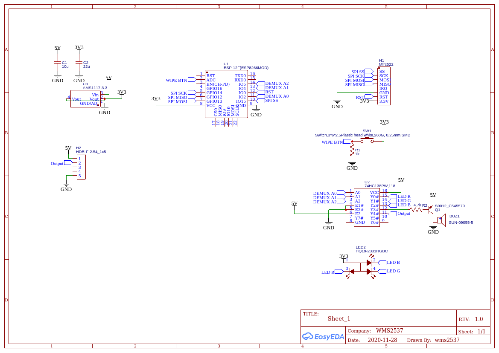
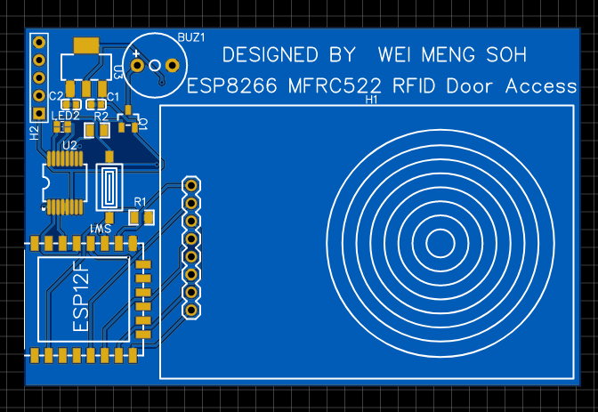

# ESP8266-RFID-door-access
A RFID door access system based on ESP8266 and MFRC522.

## Hardware Required
Component | Quantity
------------ | -------------
ESP-12F | 1
MFRC522 RFID module | 1
74HC138 3-to-8 line demultiplexer | 1
S9012 PNP transistor | 1
Push Button | 1
RGB LED | 1
Other passive components please refer to schematic

## Circuit

Schmatic and sample PCB design can be found at https://easyeda.com/swmeng/esp8266_rfid_door_access

Please note that the circuit above just contain necessary items for the project to function. To program it, you have to connect a FTDI or USB to TTL converter. Then, reset with IO0 pulled down to enter program mode. After uploading code, reset again.

## Versions

### V1
Removed due to bugs.

### V2
This is a modified version of the official access control example.
* Records stored in ESP8266 SPIFFS as a JSON file.
* Using UID to identify different RFID cards.
* UID are SHA1 hashed and then stored.
* Compare hash to identify users.
  
### V3
This is an enhanced version of V2 with mobile app integration
In progress...

## Progress
V3 in progress...
